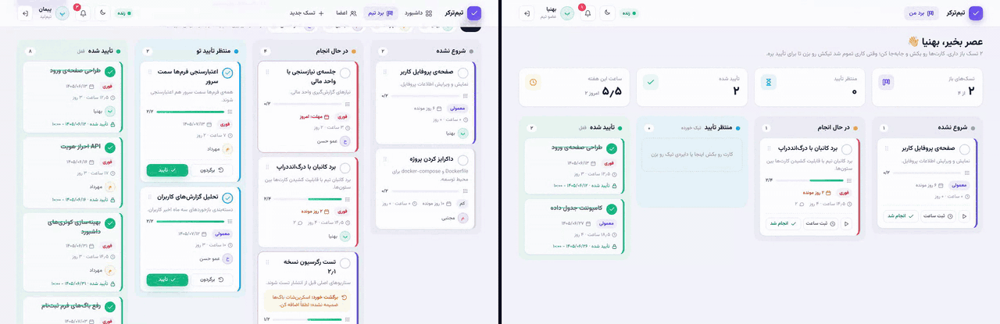
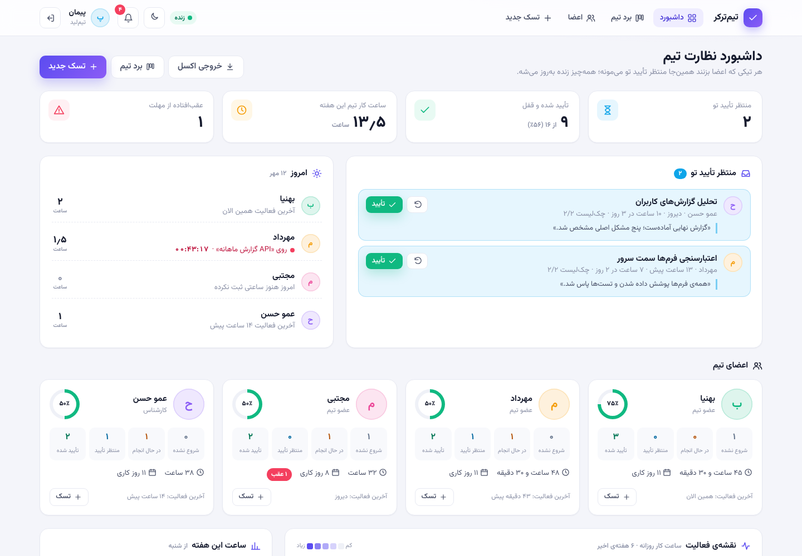
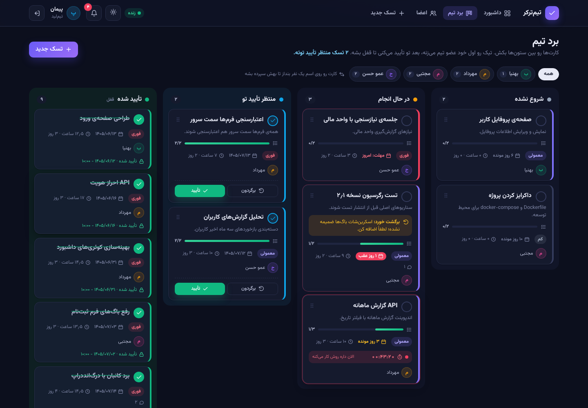
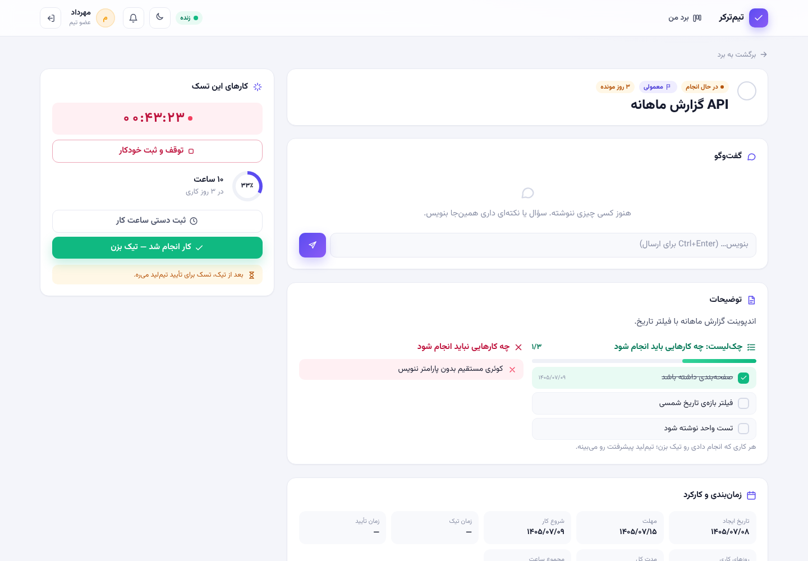
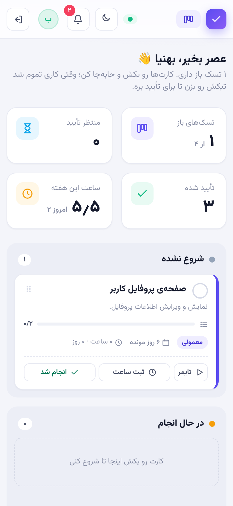
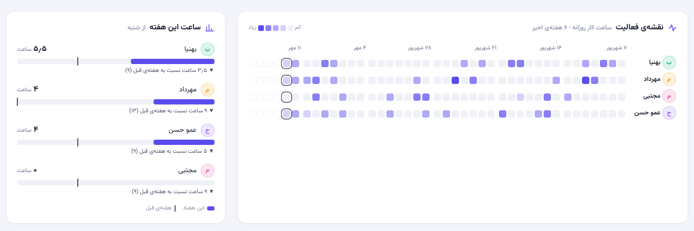
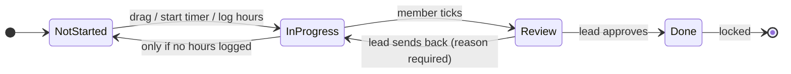

# TeamTracker

[](https://github.com/Behniasaberi/TeamTracker/actions/workflows/ci.yml)

[](LICENSE)

A Persian (RTL) task tracker for small teams. The team lead assigns tasks, members move cards on a kanban board, log their hours and tick a task when it's done. The lead then approves it — which locks it for good — or sends it back with a reason. Everything updates live for the whole team.

**Live demo:** https://teamtracker-s465.onrender.com — log in as `peyman` / `1234` (team lead) or `behnia` / `1234` (member). It runs on a free instance, so the first load can take up to a minute; data resets every night.

[نسخه‌ی فارسی](README.fa.md)



## Features

**Kanban board for both roles**
- Four columns: not started → in progress → waiting for review → approved
- Drag and drop on desktop and touch; columns you can't drop into fade out and say why
- Members tick a task by dragging it to *review*; the lead approves by dragging it to *approved*, or drags it back with a reason
- The lead can drop a card on someone's name to hand the task over (only before any hours are logged)
- Cards show deadline countdowns, checklist progress, rejection notes, comments and a live timer

**Review & lock**
- Ticked tasks wait in the lead's review queue
- Approved tasks are locked at three levels: service rules, the repository and the UI

**Work tracking**
- Start/stop timer on a card (one running timer per person), or log hours manually with a Jalali date picker
- Per-task checklist the member ticks item by item
- Comments on each task, with notifications for the other side

**Lead dashboard**
- Review queue, "today" panel (who's working on what right now), member cards
- 6-week activity heatmap and this-week vs last-week hours
- Excel export (.xlsx, right-to-left sheets): detailed hours, per-member summary, report info
- Team management: add members, edit names/titles, reset passwords

**Everything else**
- Real-time updates with SignalR (falls back to polling if the socket drops)
- Notification bell with unread count
- Dark mode, Persian digits everywhere, Jalali dates
- Works offline: fonts and JS libraries are bundled, no CDN

## Screenshots

| Lead dashboard | Team board (dark) |
|---|---|
|  |  |

| Task page | Mobile |
|---|---|
|  |  |



## Tech stack

- ASP.NET Core 8 MVC + Razor views
- SignalR for live updates
- EF Core 8 + SQLite (or a plain JSON file — see [Configuration](#configuration))
- Vanilla JS: SortableJS for drag and drop, a small Jalali date picker in `wwwroot/js/jdate.js`
- Bootstrap 5 (RTL) + custom CSS with light/dark tokens
- xUnit for tests, GitHub Actions for CI, Docker for deployment

## Task lifecycle



## Getting started

Requires the [.NET 8 SDK](https://dotnet.microsoft.com/download/dotnet/8.0).

```bash
git clone https://github.com/Behniasaberi/TeamTracker.git
cd TeamTracker
dotnet run --project TeamTracker.csproj
```

Open http://localhost:5005. On first run a SQLite database is created in `App_Data/` with sample data.
All sample accounts use the password `1234`:

| User | Role |
|---|---|
| `peyman` | Team lead |
| `behnia`, `mehrdad`, `mojtaba` | Members |
| `hassan` | Member (specialist) |

To see the live updates, log in as `behnia` in one window and as `peyman` in a private window, then tick *برد کانبان با درگ‌اند‌دراپ* on Behnia's board.

### Docker

```bash
docker compose up --build
```

The app runs on http://localhost:8080. The compose file turns on the nightly demo reset; set `Demo__DailyReset` to `false` for real use.
There is also a `render.yaml` for a one-click deploy on [Render](https://render.com).

## Configuration

`appsettings.json`:

| Key | Default | |
|---|---|---|
| `Storage:Provider` | `Sqlite` | `Sqlite` or `Json` (`App_Data/data.json`, no database) |
| `ConnectionStrings:TeamTracker` | *(empty)* | SQLite connection string; defaults to `App_Data/teamtracker.db` |
| `Demo:DailyReset` | `false` | Reset to sample data every night at 04:00 |

To start over with fresh sample data, delete `App_Data/teamtracker.db` (or `data.json`).

## Tests

```bash
dotnet test TeamTracker.Tests
```

The tests cover the review cycle and locking, which moves each role is allowed to make, reassigning, the timer, daily hour limits, comments and notifications, team management, and the SQLite repository.

## Project structure

```
Controllers/        Leader, Member, Comments, Notifications, Account
Services/           TaskService (business rules), UserService, ReportService, XlsxWriter,
                    Live (SignalR hub + notifier), Core (repository interface, Persian formatting)
Data/               StorageSetup, JsonDataStore, InMemoryTaskRepository, SeedData
Data/Sqlite/        AppDbContext, EfTaskRepository
Models/ ViewModels/
Views/Shared/       _Board, _KanbanCard, _Comments, _TaskInfo, modals
wwwroot/js/         site.js, live.js, board.js, jdate.js
TeamTracker.Tests/  xUnit tests
```

All data access goes through `ITaskRepository`, so the JSON store, the in-memory store used by the tests and the EF Core store are interchangeable.

## License

[MIT](LICENSE)
